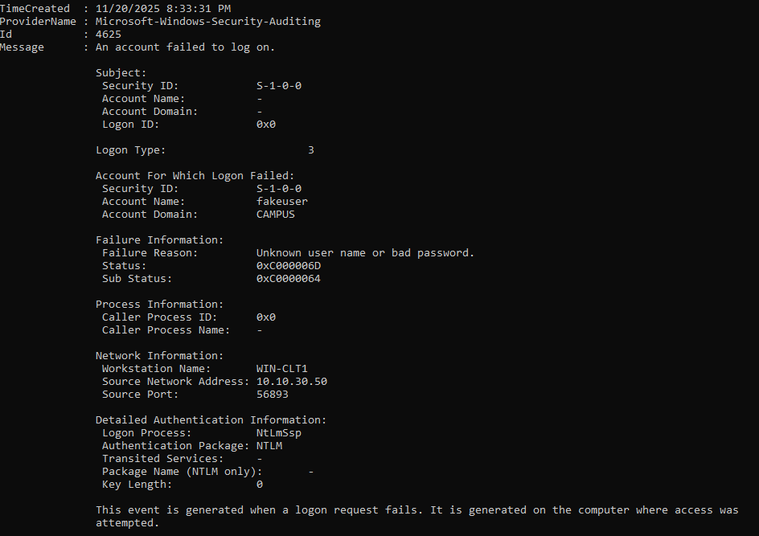

# Campus-Security-Operations-Lab-AD-Nessus-and-Threat-Hunting
Home lab simulating a small campus network with pfSense, Active Directory, Nmap, Nessus, and basic threat hunting in Windows event logs.

## 1. Overview

This lab simulates a small Windows domain behind a pfSense firewall, with a domain controller, Windows client, and a Nessus Essentials scanner.  

Goals:

- Build and harden a basic AD environment
- Discover hosts and services with Nmap
- Run unauthenticated and authenticated Nessus scans
- Generate suspicious activity and hunt it in Windows event logs

**Technologies used**

- VirtualBox (VM hosting)
- GNS3 (network emulation / topology)
- pfSense (firewall / router)
- Windows Server 2022 (AD DS, GPO, Event Viewer)
- Windows 11 client
- Nmap
- Tenable Nessus Essentials

## 1.1 How to reproduce this lab

**Prerequisites**

- Host OS: Windows / Linux with VirtualBox and GNS3
- RAM: ~16 GB recommended
- Disk: ~150 GB free
- ISOs: pfSense, Windows Server 2022, Windows 11 Enterprise Evaluation
- Nessus Essentials account (free)

**High-level build steps**

1. Build the GNS3 topology shown in Section 2 using pfSense and a router.
2. Install and configure pfSense interfaces as in Section 3.1.
3. Deploy WIN-DC1, promote to domain controller, and configure IP/DNS.
4. Deploy WIN-CLT1, join it to the CAMPUS domain.
5. Create OUs, users, groups, and GPOs as in Section 4.
6. Install Nmap and Nessus on WIN-CLT1 and run the scans in Section 5–6.
7. Simulate the failed logons and hunt Event 4625 as in Section 7.

## 2. Lab Topology

**Key components**

- pfSense firewall, routing between lab networks
- WIN-DC1, Windows Server domain controller, 10.10.20.10
- WIN-CLT1, Windows 11 domain joined client, 10.10.30.50
- Nessus Essentials on WIN-CLT1, scanning both hosts

## 3. Network Configuration

### pfSense interfaces

- `em0` 10.10.254.2, transit network toward GNS3 router
- `em1` 172.16.0.1, management or WAN side used by GNS3

### Domain controller IP

- IP 10.10.20.10, subnet 255.255.255.0
- Default gateway 10.10.20.1 (router toward pfSense)
- DNS points to itself

### Client IP and connectivity

  

- Client IP 10.10.30.50
- Client can ping 10.10.20.10 and use it as domain controller

## 4. Active Directory Design

### OUs and users

- `OU=Campus-Users`
  - `OU=Students`
  - `OU=Staff`

Example test users:

- `Alex Student`
- `Sam Staff`

### Security groups

- `GG-Students`
- `GG-Staff`

Groups are used for Group Policy filtering so students and staff receive different restrictions.

### Group Policy objects

Custom GPOs:

- `GG_Students_Lockdown`
- `GG_Staff_Standard`

Linked to the appropriate OUs:

### GPO results on clients

Student:

Staff:

This confirms the correct policies are applied to each user type through security group filtering.

## 5. Network Discovery and Port Scanning

### 5.1 Host discovery

Used `nmap -sn 10.10.30.0/24` to discover live hosts. The scan identified:

- 10.10.30.1, router
- 10.10.30.50, client

### 5.2 Service scans

Domain controller:

Client:

These show typical Windows services open on the DC, for example RPC, SMB, and directory related ports, and workstation services on the client. These screenshots go into the “network enumeration” section of the write-up.

## 6. Nessus Vulnerability Management

### 6.1 Scan configuration

- Policy based on Basic Network Scan
- Targets, 10.10.20.10 and 10.10.30.50
- Authenticated Windows credentials, `CAMPUS\administrator`

### 6.2 Unauthenticated scan results

Hosts summary:

Domain controller:

Client:

### 6.3 Authenticated scan results

Domain controller:

Hosts summary:

The authenticated scan provides deeper findings such as missing patches, insecure configuration settings, and local privilege escalation issues.

Raw exports are in the `nessus` folder:

- `nessus/campus-lab-baseline-vuln-scan.html`
- `nessus/campus-lab-baseline-vuln-scan.csv`

### 6.4 High level remediation plan

Examples of actions that could be taken based on typical Nessus findings:

- Apply missing Windows security updates on WIN-DC1 and WIN-CLT1
- Review and harden SMB configuration, disable SMBv1 where possible
- Enforce strong password and lockout policies through Group Policy
- Reduce exposed services on the client, for example disable unused management ports

(You can refine this list based on the actual high and critical findings in the CSV.)

## 7. Mini Threat Hunt

### 7.1 Simulated attack activity

A small noisy event was created by trying repeatedly to reach the DC admin share with incorrect credentials.

### 7.2 Event log on DC1

Event 4625 showing the failed logon from WIN-CLT1:

This event ties the simulated attack back to the client:

- Event ID 4625 – An account failed to log on  
- Account Name: `fakeuser`  
- Account Domain: `CAMPUS`  
- Workstation Name: `WIN-CLT1`  
- Source Network Address: `10.10.30.50`  

Together with the earlier screenshot from WIN-CLT1, this shows end to end visibility from a noisy authentication attempt on the client to the corresponding security log entry on the domain controller.

## 8. Vulnerability remediation plan and next steps

This lab intentionally starts in a “Day 0” baseline state with missing patches and weak defaults.  
The goal of this section is to outline how I would harden the environment based on the Nessus
findings and standard hardening guidance.

### 8.1 Priorities

Remediation is grouped by priority:

- **P1 – Critical and High vulnerabilities**
  - Apply all missing Windows cumulative updates on `WIN-DC1` and `WIN-CLT1`.
  - Patch .NET, Microsoft Edge, and any other components flagged as Critical or High.
  - Reboot and re-run the authenticated Nessus scan to confirm that all Critical and High findings
    are cleared or reduced.

- **P2 – Reduce attack surface**
  - Review open ports from the Nmap and Nessus results and disable unneeded services.
  - Restrict RDP to administrators only, enforce Network Level Authentication, and block RDP
    from non-trusted networks.
  - Tighten Windows Firewall rules on both the domain controller and the client.

- **P3 – Strengthen identity and access controls**
  - Enforce strong password and lockout policies through Group Policy.
  - Create separate admin accounts for domain administration and remove day-to-day use of
    `CAMPUS\administrator`.
  - Limit membership of privileged groups (Domain Admins, Enterprise Admins, etc.).

- **P4 – Hardening and configuration baselines**
  - Move toward CIS Benchmarks or Microsoft Security Baselines for Windows Server and
    Windows 11.
  - Disable legacy protocols where possible (for example, older SMB dialects, weak TLS versions).
  - Standardize secure browser settings for Edge on both hosts.

- **P5 – Monitoring and detection**
  - Forward Security and System logs from `WIN-DC1` and `WIN-CLT1` to a central log collector
    or SIEM.
  - Build detections around repeated failed logons (Event ID 4625), RDP activity, and changes
    to group membership or GPOs.

### 8.2 Host-specific hardening

**Domain controller – `WIN-DC1` (10.10.20.10)**

- Patch to the latest supported Windows Server cumulative update.
- Review all Critical / High Nessus findings for `WIN-DC1` and:
  - Apply OS and .NET updates.
  - Harden SMB (signing required, guest access disabled).
  - Enforce secure protocols and ciphers for remote management.
- Lock down RDP:
  - Allow only from administrative workstations or a jump host.
  - Require NLA and strong authentication.
- Apply AD-focused GPOs:
  - Password, lockout, and Kerberos policies.
  - Logging and auditing settings for account management, logon events, and object access.

**Client – `WIN-CLT1` (10.10.30.50)**

- Patch Windows 11 to current.
- Patch Edge and any other client-side software flagged by Nessus.
- Enable BitLocker and secure boot (for a real deployment).
- Use GPO to enforce:
  - Browser security settings.
  - Local firewall rules.
  - Restrictions on running unsigned scripts or unknown binaries.
 
### 8.3 Alignment with NIST CSF

This lab is small, but the workflow roughly follows the NIST Cybersecurity Framework:

- **Identify:** Use Nmap and Nessus to discover hosts, services, and vulnerabilities.
- **Protect:** Apply Group Policy, AD design, and basic hardening to reduce attack surface.
- **Detect:** Use Windows Security logs (Event ID 4625) to identify suspicious authentication activity.
- **Respond:** Prioritize and plan remediation based on Nessus findings.

The goal is to practice the same kind of iterative “identify → protect → detect → respond” cycle that would be used in a real environment, just on a smaller campus-style network.

## 9. Skills demonstrated

- Designing and implementing a routed lab network with pfSense
- Building and managing a small Active Directory domain
- Using Nmap for host discovery and service enumeration
- Running unauthenticated and authenticated Nessus scans and exporting results
- Correlating simulated attack activity on a client with domain controller security logs (Event ID 4625)
