# Campus-Security-Operations-Lab-AD-Nessus-and-Threat-Hunting
Home lab simulating a small campus network with pfSense, Active Directory, Nmap, Nessus, and basic threat hunting in Windows event logs.

## 1. Overview

This lab simulates a small Windows domain behind a pfSense firewall, with a domain controller, Windows client, and a Nessus Essentials scanner.  

Goals:

- Build and harden a basic AD environment
- Discover hosts and services with Nmap
- Run unauthenticated and authenticated Nessus scans
- Generate suspicious activity and hunt it in Windows event logs

## 2. Lab Topology

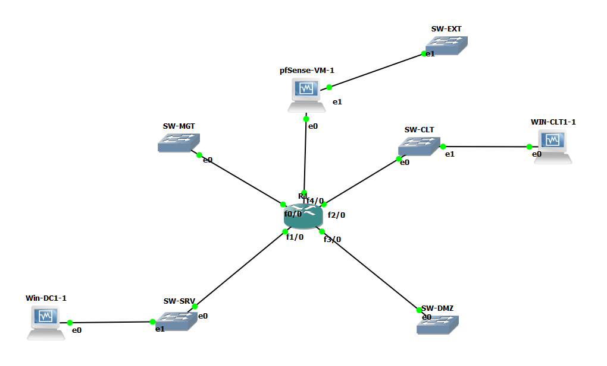

**Key components**

- pfSense firewall, routing between lab networks
- WIN-DC1, Windows Server domain controller, 10.10.20.10
- WIN-CLT1, Windows 11 domain joined client, 10.10.30.50
- Nessus Essentials on WIN-CLT1, scanning both hosts

## 3. Network Configuration

### pfSense interfaces

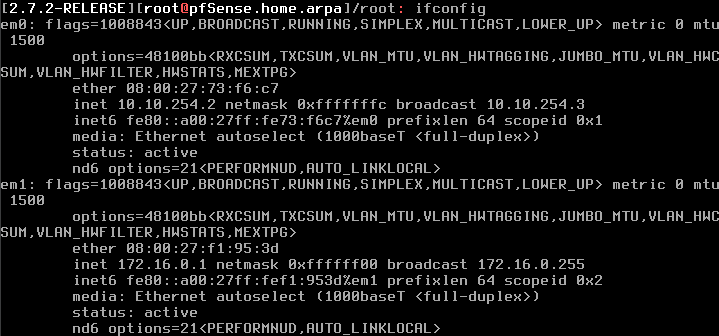

- `em0` 10.10.254.2, transit network toward GNS3 router
- `em1` 172.16.0.1, management or WAN side used by GNS3

### Domain controller IP

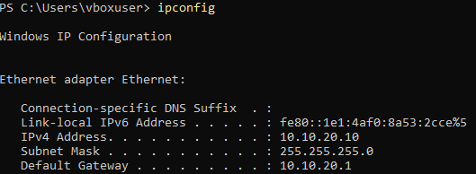

- IP 10.10.20.10, subnet 255.255.255.0
- Default gateway 10.10.20.1 (router toward pfSense)
- DNS points to itself

### Client IP and connectivity

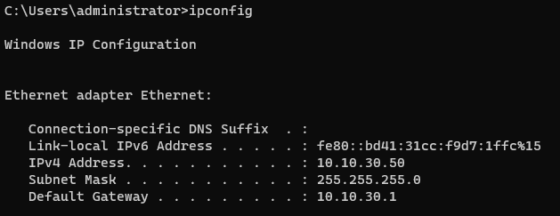  
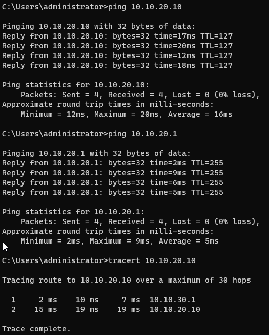

- Client IP 10.10.30.50
- Client can ping 10.10.20.10 and use it as domain controller

## 4. Active Directory Design

### OUs and users

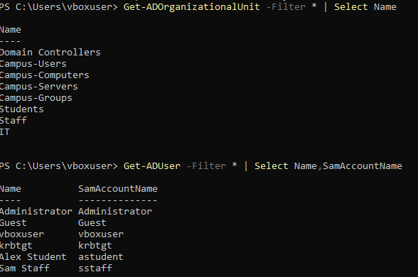

- `OU=Campus-Users`
  - `OU=Students`
  - `OU=Staff`

Example test users:

- `Alex Student`
- `Sam Staff`

### Security groups

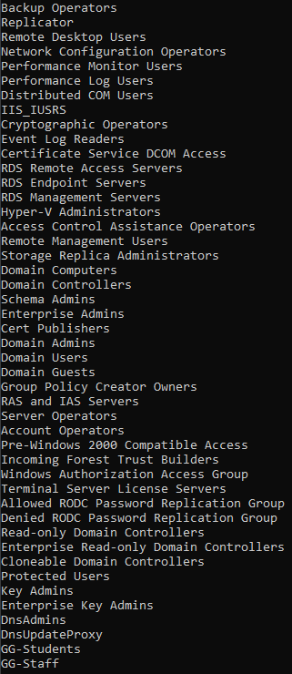

- `GG-Students`
- `GG-Staff`

Groups are used for Group Policy filtering so students and staff receive different restrictions.

### Group Policy objects

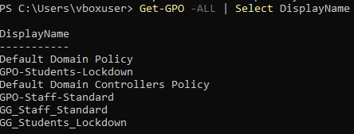

Custom GPOs:

- `GG_Students_Lockdown`
- `GG_Staff_Standard`

Linked to the appropriate OUs:

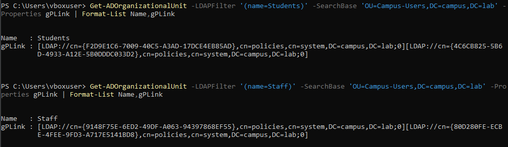

### GPO results on clients

Student:

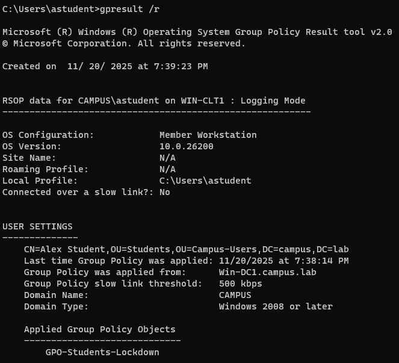

Staff:

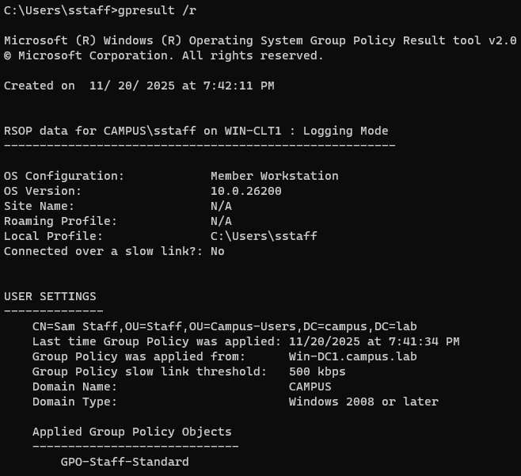

This confirms the correct policies are applied to each user type through security group filtering.

## 5. Network Discovery and Port Scanning

### 5.1 Host discovery

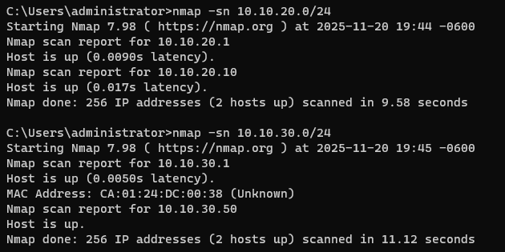

Used `nmap -sn 10.10.30.0/24` to discover live hosts. The scan identified:

- 10.10.30.1, router
- 10.10.30.50, client

### 5.2 Service scans

Domain controller:

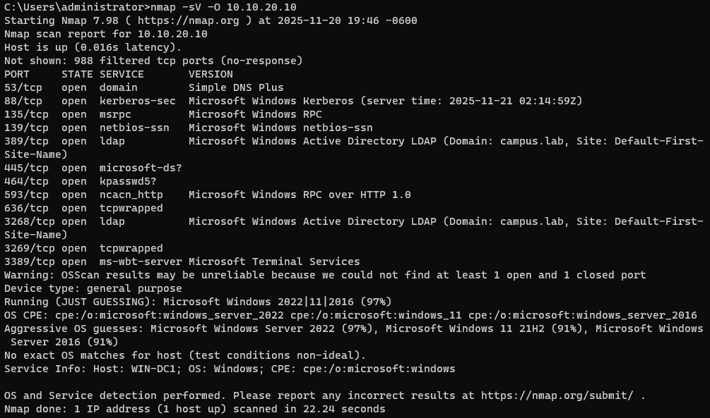

Client:

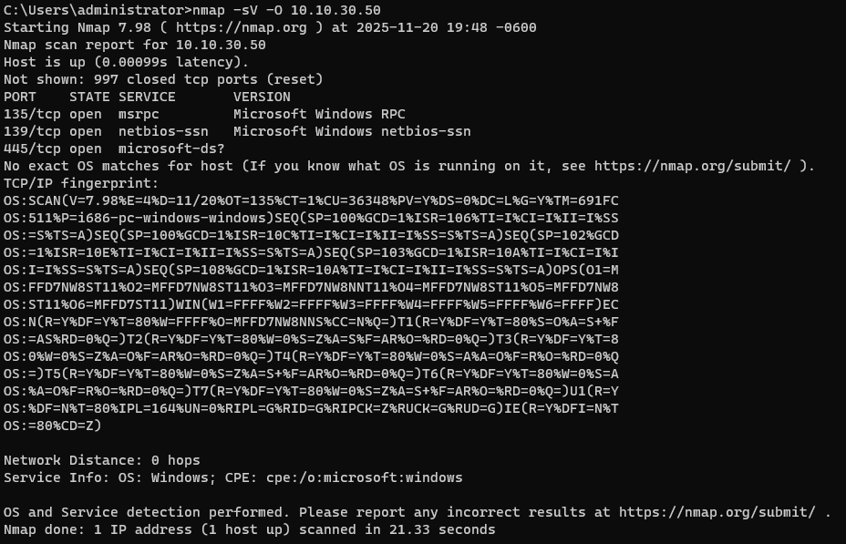

These show typical Windows services open on the DC, for example RPC, SMB, and directory related ports, and workstation services on the client. These screenshots go into the “network enumeration” section of the write-up.

## 6. Nessus Vulnerability Management

### 6.1 Scan configuration

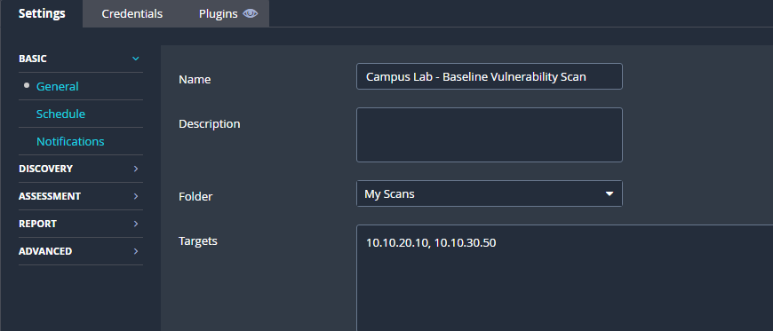

- Policy based on Basic Network Scan
- Targets, 10.10.20.10 and 10.10.30.50
- Authenticated Windows credentials, `CAMPUS\administrator`

### 6.2 Unauthenticated scan results

Hosts summary:

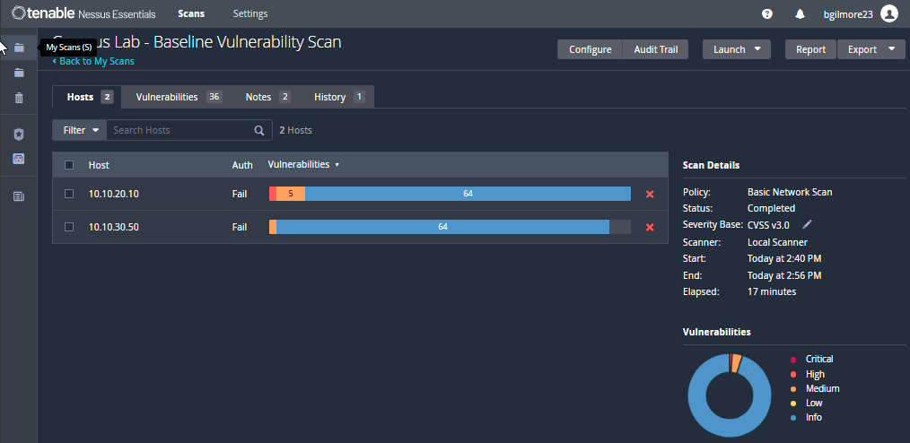

Domain controller:

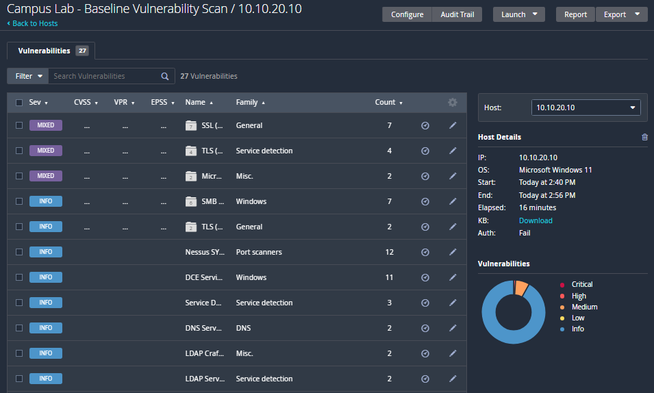

Client:

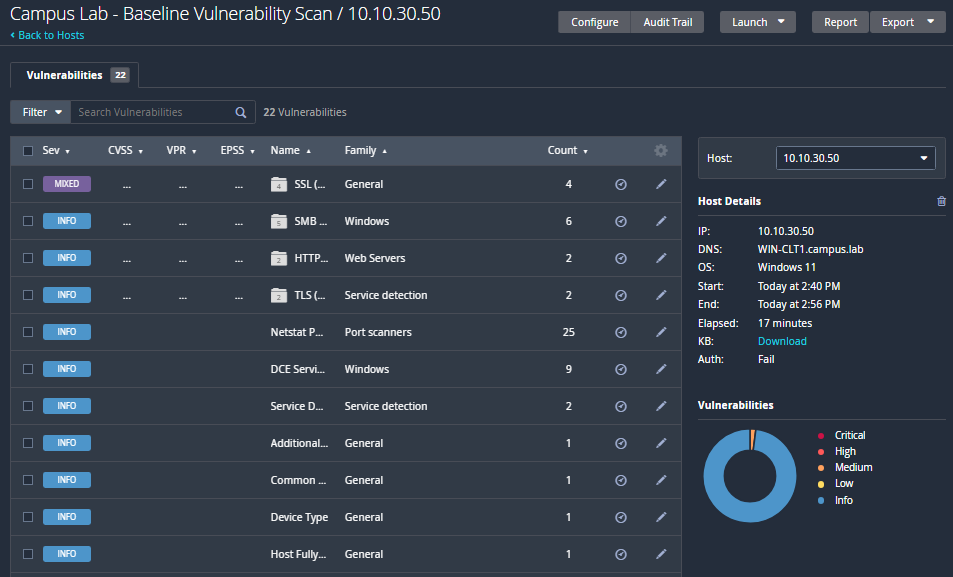

### 6.3 Authenticated scan results

Domain controller:

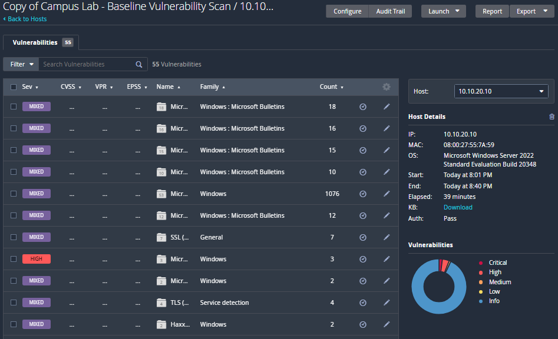

Hosts summary:

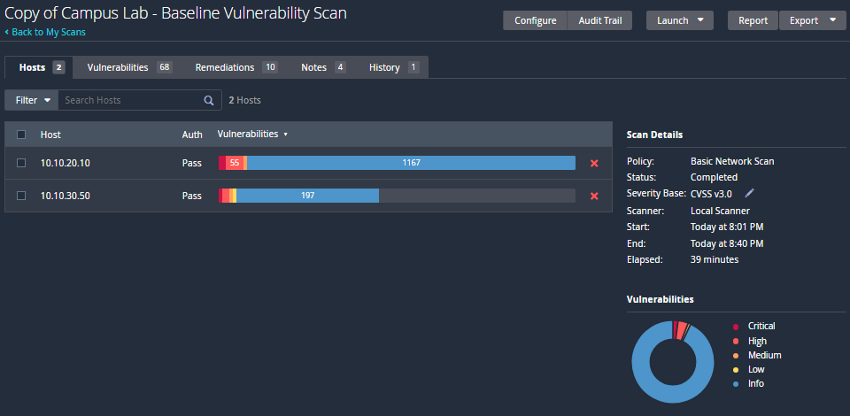

The authenticated scan provides deeper findings such as missing patches, insecure configuration settings, and local privilege escalation issues.

Raw exports are in the `nessus` folder:

- `nessus/campus-lab-baseline-vuln-scan.html`
- `nessus/campus-lab-baseline-vuln-scan.csv`

### 6.4 High level remediation plan

Examples of actions that could be taken based on typical Nessus findings:

- Apply missing Windows security updates on WIN-DC1 and WIN-CLT1
- Review and harden SMB configuration, disable SMBv1 where possible
- Enforce strong password and lockout policies through Group Policy
- Reduce exposed services on the client, for example disable unused management ports

(You can refine this list based on the actual high and critical findings in the CSV.)

## 7. Mini Threat Hunt

### 7.1 Simulated attack activity

A small noisy event was created by trying repeatedly to reach the DC admin share with incorrect credentials.

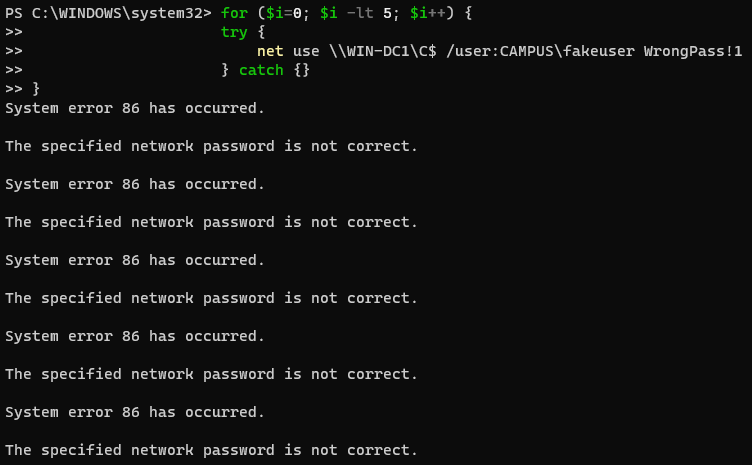

Command used on WIN-CLT1:

```powershell
for ($i = 0; $i -lt 5; $i++) {
    try {
        net use \\WIN-DC1\C$ /user:CAMPUS\fakeuser WrongPass!1
    } catch {}
}
